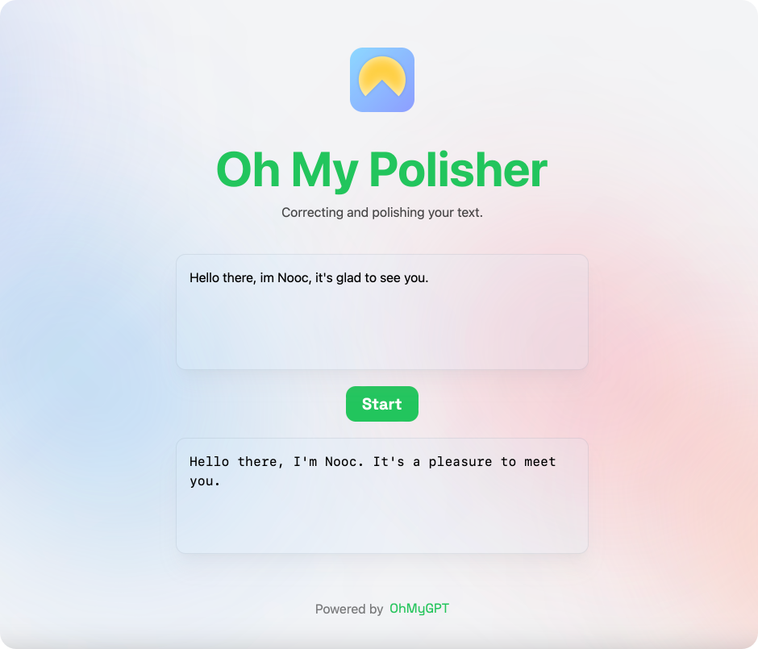

# OhMyGPT

[English](README.md)

OhMyGPT 是一个项目，它使您能够在几分钟内部署基于 ChatGPT 的 Web 应用程序，只需配置一些环境变量即可。您会得到一个类似于 https://polisher.vercel.app 和 https://ohmyzhen.vercel.app 的 Web 应用程序。

要部署基于 ChatGPT 的 Web 应用程序，您将需要来自 [OpenAI](https://platform.openai.com/account/api-keys) 的 API 密钥和一个[Vercel](https://vercel.com)帐户。我们计划将来扩大我们的支持范围，包括更多的云平台。但是目前，它只在 Vercel 上进行了测试。



## 开始

1. 将此 repo fork 到您自己的 GitHub 账户中。
2. 登录您的 [Vercel](https://vercel.com) 控制台，从 fork 的 repo 创建一个新项目。（⚠️ 注意此时不要点击 Deploy 按钮）
3. 在配置项目步骤中 [设置环境变量](#设置环境变量)。
4. 部署应用程序，并让 Vercel 完成部署过程。
5. 在您的浏览器中访问您的 Web 应用程序，并将其分享给您的朋友。🥳

## 设置环境变量

您可以使用环境变量自定义应用程序。以下是所有可用变量及其用途：

```env
＃客户端

# 应用程序 LOGO 的 URL。
APP_LOGO="https://avatars.githubusercontent.com/u/38027416?v=4"
# 应用名称。
APP_NAME="Oh My Polisher"
# 概述您的应用程序的行为并向用户展示如何使用它。
APP_SUMMARY="纠正和润色您的文本。"
# 显示用户如何使用应用的示例输入。
EXAMPLE_INPUT="你好，我Nooc，很高兴见你。"

＃服务器端

# 必填，从 OpenAI（https://platform.openai.com/account/api-keys）获取的 API Key
OPENAI_API_KEY="sk-XXXXXXXXX"
# 可选，OpenAI API 的代理服务器。当官方 OpenAI API 服务器无法访问时使用。
OPENAI_API_BASE_URL=""
# 可选，系统消息帮助设置助手的行为。 （从 https://platform.openai.com/docs/guides/chat/introduction 了解更多）
SYSTEM_MESSAGE="你是一个语言润色器，纠正和润色给定的内容。"
# 可选，消息模板用于包装用户输入，模板中的 '{{input}}' 字符串将被用户输入替换。
MESSAGE_TEMPLATE="纠正并润色以下内容："
```

您可以编辑位于此项目的根目录中名为 `.env.example` 的示例文件。完成必要的更改后，您可以将文件的整个内容复制并粘贴到 Vercel 控制台上的 "环境变量" 输入字段中。
